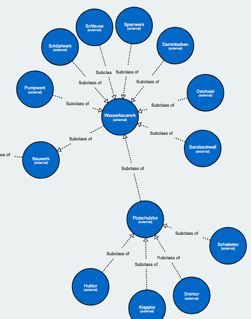

# RESCUE MATE Ontology

The RESCUE-MATE research project investigates the challenges of creating situation reports and optimizing information flows in the scenario of a storm surge in Hamburg.
The RESCUE-MATE Ontology used for the integration of multiple data sources in the RESCUE-MATE knowledge graph.
